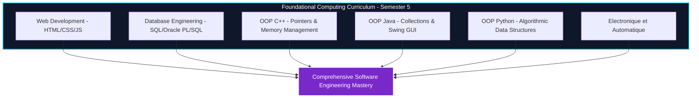

# Architecture Overview — ENIAD Foundational Computing Engineering Laboratories

```mermaid
graph TD
    subgraph S5_Curriculum [Foundational Computing Curriculum - Semester 5]
        Web[Web Development - HTML/CSS/JS]
        DB[Database Engineering - SQL/Oracle PL/SQL]
        CPP[OOP C++ - Pointers & Memory Management]
        Java[OOP Java - Collections & Swing GUI]
        Python[OOP Python - Algorithmic Data Structures]
        EA[Electronique et Automatique]
    end
    Web --> Eng[Comprehensive Software Engineering Mastery]
    DB --> Eng
    CPP --> Eng
    Java --> Eng
    Python --> Eng
    EA --> Eng
    style S5_Curriculum fill:#0F172A,stroke:#00D9FF,stroke-width:2px,color:#fff
    style Eng fill:#7928CA,stroke:#fff,stroke-width:2px,color:#fff

```
