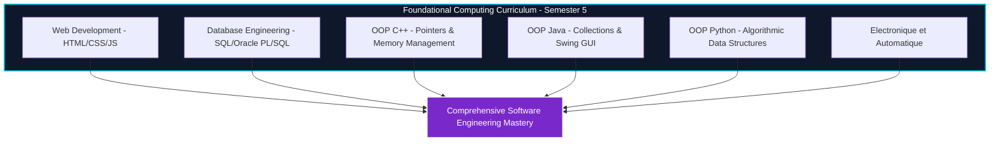

# Welcome to the ENIAD Foundational Computing Engineering Laboratories Documentation Wiki 📖

Welcome to the official technical documentation and engineering reference for **ENIAD Foundational Computing Engineering Laboratories**.

---

## 🎯 Academic & Technical Mission

Core Software Engineering Laboratory Curriculum: Modern Web Development (HTML5/CSS3/JS), Relational Database Engineering (SQL & Oracle PL/SQL), and Object-Oriented Programming (C++, Java, Python).

Developed within the **State Engineering Degree in Artificial Intelligence & Digital Systems** at the **École Nationale d'Intelligence Artificielle et du Digital (ENIAD)**, Berkane, Morocco.

---

## 📚 Wiki Documentation Chapters

| Chapter | Description | Primary Topics |
| :--- | :--- | :--- |
| **[[Architecture]]** | Deep architectural design & component topology | Mermaid diagrams, component interactions, runtime environment |
| **[[Getting-Started]]** | Developer setup & workstation configuration | Prerequisites, toolchain setup, execution commands |
| **[[Curriculum-Guide]]** | Detailed syllabus and laboratory breakdown | Lab objectives, expected outputs, deliverables |

---

## 🏛️ System Architecture Snapshot

---

## 💻 Pedagogical Pillars

1. **Procedural to Object-Oriented Shift**: Transitioning from imperatively structured routines to modular object-oriented classes across C++, Java, and Python.
2. **Relational Data Integrity**: Designing database relational schemas, applying primary/foreign key constraints, and optimizing query execution plans.
3. **Modern Web Standards**: Authoring valid HTML5 semantic documents, CSS3 responsive grid layouts, and event-driven JavaScript asynchronous logic.

---

*Maintained with ❤️ by [Oussama EL HADJI](https://github.com/Bosaj) • ENIAD Berkane*
